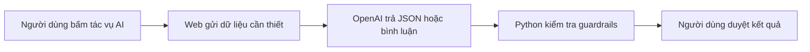

# API và đánh giá LLM - bản giải thích để thuyết trình

## API làm gì trong Project 09?

API là cầu nối giữa ứng dụng Streamlit và mô hình OpenAI. API key là mã bí mật xác thực cho các yêu cầu đó. API key không phải mật khẩu ChatGPT và gói ChatGPT Plus không tự cung cấp API credit.

Project này kết nối endpoint OpenAI. Khóa lấy từ Google AI Studio thường bắt
đầu bằng `AIza` không thể đặt vào `OPENAI_API_KEY`; ứng dụng sẽ nhận diện và
hiển thị hướng dẫn thay vì cố gửi khóa sang sai nhà cung cấp.

Không bấm tác vụ AI thì web không gọi API. Form thủ công, validation, công thức tài chính, ba kịch bản, what-if, stress test, biểu đồ và PDF đều chạy bằng Python.

## Ba tác vụ LLM

1. **Trích xuất hồ sơ:** chuyển mô tả tự nhiên thành 15 trường có cấu trúc.
2. **Làm rõ dữ liệu:** diễn đạt lại câu hỏi về trường còn thiếu hoặc chưa rõ; rule gốc vẫn được giữ.
3. **Giải thích trade-off:** bình luận định tính dựa trên kết quả Python, không tự tạo số và không khuyến nghị mua/bán.

Nếu lần trích xuất không nhận diện được bất kỳ trường tài chính hữu ích nào,
web không ghi đè hồ sơ hiện tại và không tự chuyển sang trang Xác nhận. Người
dùng được giữ lại ở bước Hồ sơ để bổ sung mô tả hoặc chuyển sang nhập thủ công.

## Dữ liệu nào được gửi?

- Trích xuất: chỉ đoạn mô tả người dùng nhập.
- Làm rõ: chỉ danh sách câu hỏi rule-based, không gửi toàn bộ hồ sơ.
- Giải thích: chỉ facts/kết quả đã được Python kiểm tra; không gửi ghi chú thô.
- Đánh giá live: các mô tả giả lập trong `data/test_cases.json`, không phải dữ liệu cá nhân thật.

## Vì sao trước đây có `not_measured`?

Không thể gọi một chỉ số là “đã đo LLM” khi chưa thực sự gọi mô hình. Bản mới không điền số giả. Baseline form luôn được đo tại máy; live metrics chỉ được tạo sau khi có API key và người dùng bấm **Chạy đánh giá LLM thật**.

## Cách chạy đánh giá

1. Sao chép `.env.example` thành `.env`.
2. Điền `OPENAI_API_KEY` và giữ file này riêng tư.
3. Chạy web, mở tab **Báo cáo** và kéo xuống **Đánh giá hệ thống**.
4. Chọn 3, 5, 10 hoặc 20 hồ sơ rồi bấm **Chạy đánh giá LLM thật**.
5. Tải CSV để đưa vào slide/báo cáo.

Các phép đo live gồm:

- `field_accuracy`: tỷ lệ trường trích xuất đúng.
- `completeness`: tỷ lệ trường có dữ liệu được LLM trả đủ.
- `llm_groundedness`: tỷ lệ bình luận hoàn chỉnh vượt qua guardrails tự động.
- `llm_hallucination_rate`: tỷ lệ bình luận bị chặn vì tự thêm số hoặc kết luận định lượng.
- Thời gian trích xuất trung bình và danh sách failure cases.

Groundedness tự động chỉ là phép sàng lọc. Nhóm vẫn cần đọc một số output và ghi nhận xét human review khi trình bày kết quả cuối.
